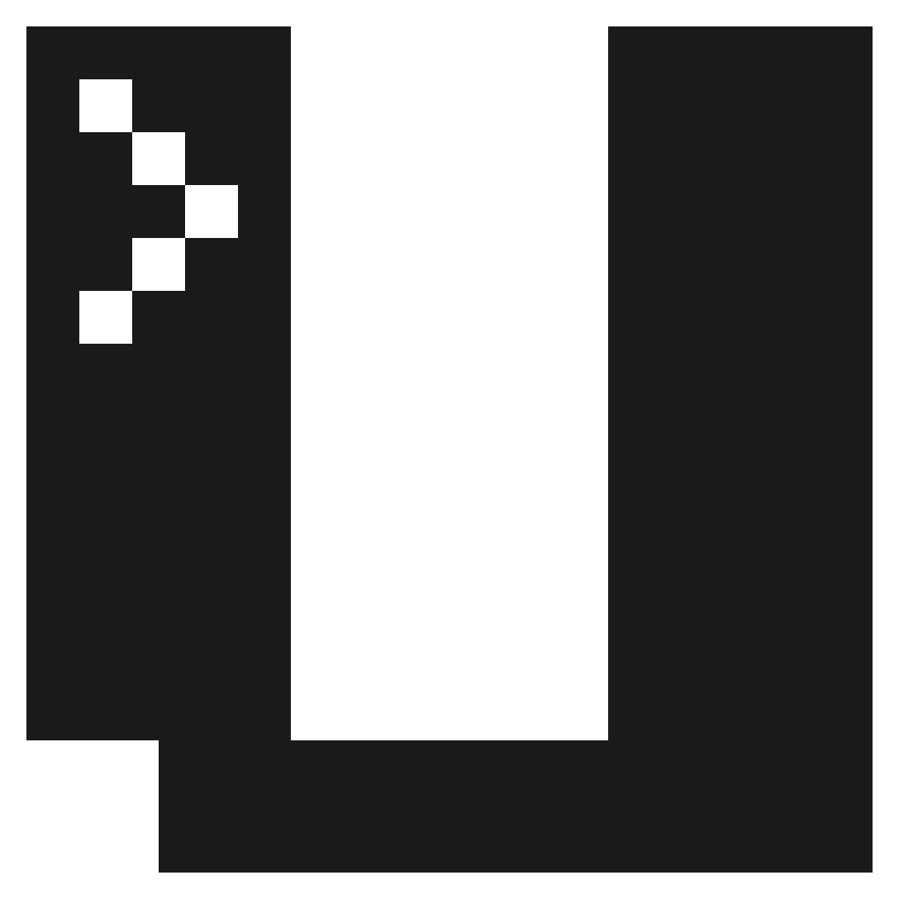

<!-- markdownlint-disable MD033 -->
<!-- markdownlint-disable MD041 -->
<p align="center">
  <picture>
    <source media="(prefers-color-scheme: dark)" srcset="logo/uac-light.svg">
    
  </picture>

  <h2 align="center">Unix-like Artifacts Collector (UAC)</h2>

  <p align="center">
    <a href="https://github.com/tclahr/uac/actions/workflows/shellcheck.yaml" alt="Issues">
      </a>
    <a href="https://bestpractices.coreinfrastructure.org/projects/5640" alt="CII Best Practices">
      </a>
    <a href="https://github.com/tclahr/uac/releases" alt="GitHub release (latest by date including pre-releases)">
      </a>
    <a href="https://github.com/tclahr/uac/LICENSE" alt="License">
      </a>
  </p>

  <p align="center">
    <a href="#-about-uac">About</a>
    •
    <a href="#-documentation">Documentation</a>
    •
    <a href="#-main-features">Main Features</a>
    •
    <a href="#-supported-operating-systems">Supported Operating Systems</a>
    •
    <a href="#-usage">Usage</a>
    •
    <a href="#-contributing">Contributing</a>
    •
    <a href="#-support">Support</a>
    •
    <a href="#-license">License</a>
  </p>
</p>
<!-- markdownlint-enable MD033 -->
<!-- markdownlint-enable MD041 -->

## 🔎 About UAC

**UAC (Unix-like Artifacts Collector)** is a powerful and extensible incident response tool designed for forensic investigators, security analysts, and IT professionals. It automates the collection of artifacts from a wide range of Unix-like systems, including AIX, ESXi, FreeBSD, Linux, macOS, NetBSD, NetScaler, OpenBSD and Solaris.

Whether you're handling an intrusion, conducting forensic investigations, or performing compliance checks, UAC simplifies and accelerates data collection while minimizing reliance on external support during critical incidents.

### Key Highlights

- 📂 Fully customizable via YAML profiles for tailored data collection.
- ⚡ Lightweight, portable, and requires no installation or dependencies.
- 🔒 Adheres to the order of volatility to ensure reliable data acquisition.
- 🛠 Designed for diverse environments, including IoT devices and NAS systems.


## 📘 Documentation

Full documentation is available at the [project documentation page](https://tclahr.github.io/uac-docs).

## 🌟 Main Features

- Run everywhere with no dependencies (no installation required).
- Customizable and extensible collections and artifacts.
- Respect the order of volatility during artifact collection.
- Collect information about current running processes (including processes without a binary on disk).
- Hash running processes and executable files.
- Extract files and directories status to create a bodyfile.
- Collect system and user-specific data, configuration files, and logs.
- Acquire volatile memory from Linux systems using different methods and tools.
- Support to write output to various cloud platforms.

## 💾 Supported Operating Systems

UAC runs on any Unix-like system, regardless of the processor architecture. All UAC needs is shell :)

[](#-supported-operating-systems)
[](#-supported-operating-systems)
[](#-supported-operating-systems)
[](#-supported-operating-systems)
[](#-supported-operating-systems)
[](#-supported-operating-systems)
[](#-supported-operating-systems)
[](#-supported-operating-systems)
[](#-supported-operating-systems)

*Note: UAC even runs on systems like Network Attached Storage (NAS) devices, Network devices such as OpenWrt, and IoT devices.*

## 🚀 Usage

UAC does not need to be installed on the target system. Simply download the latest version from the [releases page](https://github.com/tclahr/uac/releases), uncompress it, and launch. It's that simple!

### 🛠 Getting Started

1. Download the latest release from the [Releases page](https://github.com/tclahr/uac/releases).
2. Uncompress the archive.
3. Execute the tool directly from the terminal.

### Examples

<!-- markdownlint-disable MD033 -->
<details>
<summary>Click to view usage examples</summary>

**Collect all artifacts based on the ir_triage profile:**

```shell
./uac -p ir_triage /tmp
```

**Collect memory dump and all artifacts based on the full profile:**

```shell
./uac -a ./artifacts/memory_dump/avml.yaml -p full /tmp
```

**Collect all artifacts excluding a specific one:**

```shell
./uac -p full -a \!artifacts/bodyfile/bodyfile.yaml .
```

**Collect all artifacts based on the ir_triage profile, along with all artifacts located in the /my_custom_artifacts directory:**

```shell
./uac -p ir_triage -a /my_custom_artifacts/\* /mnt/sda1
```

**Collect all artifacts based on a custom profile:**

```shell
./uac -p /my_custom_uac_data/my_custom_uac_profile.yaml /tmp
```

</details>
<!-- markdownlint-enable MD033 -->

## 💙 Contributing

Contributions make the open-source community such an amazing place to learn, inspire, and create. Any contributions you make are greatly appreciated.

Have you created any artifacts? Please share them with us!

You can contribute with new artifacts, profiles, bug fixes, or propose new features. Please read our [Contributing Guide](CONTRIBUTING.md) before submitting a Pull Request to the project.

## 👨‍💻 Support

For general help using UAC, please refer to the [project documentation page](https://tclahr.github.io/uac-docs). For additional help, you can use one of the following channels:

- [Discord](https://discord.com/invite/digitalforensics) (For live discussion with the community and UAC team)
- [GitHub](https://github.com/tclahr/uac/issues) (Bug reports and contributions)
- [Twitter](https://twitter.com/tclahr) (Get the news fast)

## ⭐ Support the Project

If you find UAC helpful, please give us a ⭐ on [GitHub](https://github.com/tclahr/uac)! This helps others discover the project and motivates us to improve it further.

## 📜 License

The UAC project uses the [Apache License Version 2.0](LICENSE) software license.
